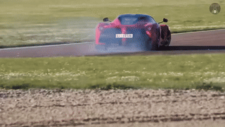
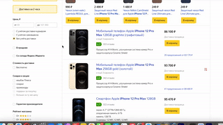
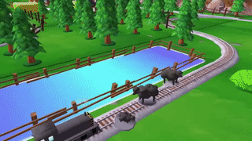
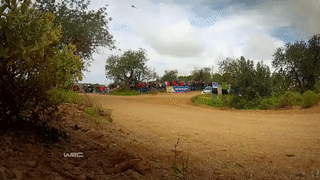

# 🐼 Panda-70M
This is the offical Github repository of Panda-70M.

**[Panda-70M: Captioning 70M Videos with Multiple Cross-Modality Teachers](https://snap-research.github.io/Panda-70M)**
</br>
[Tsai-Shien Chen](https://tsaishien-chen.github.io/),
[Aliaksandr Siarohin](https://aliaksandrsiarohin.github.io/aliaksandr-siarohin-website/),
[Willi Menapace](https://www.willimenapace.com/),
[Ekaterina Deyneka](https://edeyneka.github.io/),
[Hsiang-wei Chao](https://www.linkedin.com/in/hsiang-wei-chao),
[Byung Eun Jeon](https://www.linkedin.com/in/logan-jeon),
[Yuwei Fang](https://yuwfan.github.io/),
[Hsin-Ying Lee](http://hsinyinglee.com/),
[Jian Ren](https://alanspike.github.io/),
[Ming-Hsuan Yang](https://faculty.ucmerced.edu/mhyang/),
[Sergey Tulyakov](http://www.stulyakov.com/)
</br>
*Computer Vision and Pattern Recognition (CVPR) 2024*

[](https://arxiv.org/abs/2402.19479)
[](https://snap-research.github.io/Panda-70M)
[](https://youtu.be/m2NQ5k1oTcs)

## Introduction
Panda-70M is a large-scale dataset with 70M high-quality video-caption pairs.
This repository have three sections:
- [Dataset Dataloading](./dataset_dataloading) includes the csv files listing the data of Panda-70M and the code to download the dataset.
- [Splitting](./splitting) includes the code to split a long video into multiple semantics-consistent short clips.
- [Captioning](./captioning) includes the proposed video captioning model trained on Panda-70M.

## 🔥 Updates (Oct 2024)
To enhance the training of video generation models, which are intereted at *single-shot* videos with *meaningful motion* and *aesthetically pleasing scenes*, we introduce two additional annotations:

- **Desirability Filtering**: This annotation assesses whether a video is a suitable training sample. We categorize videos into six groups based on their characteristics: `desirable`, `0_low_desirable_score`, `1_still_foreground_image`, `2_tiny_camera_movement`, `3_screen_in_screen`, `4_computer_screen_recording`. In the below table, we present examples for each category along with the percentage of videos within the dataset.
- **Shot Boundary Detection**: This annotation provides a list of intervals representing continuous shots within a video (predicted by [TransNetV2](https://github.com/soCzech/TransNetV2)). If the length of the list is one, it indicates the video consists of a single continuous shot without any shot boundaries.

<table class="center">
  <tr>
    <td width=33.3% style="border: none"></td>
    <td width=33.3% style="border: none"></td>
    <td width=33.3% style="border: none"></td>
  </tr>
  <tr style="text-align: center;">
    <td width=33.3% style="border: none">desirable (80.5%)</td>
    <td width=33.3% style="border: none">0_low_desirable_score (5.28%)</td>
    <td width=33.3% style="border: none">1_still_foreground_image (6.82%)</td>
  </tr>
  
  <table class="center">
  <tr>
    <td width=33.3% style="border: none"></td>
    <td width=33.3% style="border: none"></td>
    <td width=33.3% style="border: none"></td>
  </tr>
  <tr>
    <td width=33.3% style="border: none">2_tiny_camera_movement (1.20%)</td>
    <td width=33.3% style="border: none">3_screen_in_screen (5.03%)</td>
    <td width=33.3% style="border: none">4_computer_screen_recording (1.13%)</td>
  </tr>
</table>
<sup>**We will remove the video samples from our dataset / Github / project webpage / technical presentation as long as you need it. Please contact tsaishienchen at gmail dot com for the request.</sup>

## Dataset

### Collection Pipeline
<p align="center" width="100%">
<a target="_blank"></a>
</p>

### Download
  | Split           | Download | # Source Videos | # Samples | Video Duration | Storage Space|
  |-----------------|----------|-----------------|-----------|----------------|--------------|
  | Training (full) | [link](https://drive.google.com/file/d/1pbh8W3qgst9CD7nlPhsH9wmUSWjQlGdW/view?usp=sharing) (2.73 GB) | 3,779,763 | 70,723,513 | 167 khrs  | ~36 TB  |
  | Training (10M)  | [link](https://drive.google.com/file/d/1LLOFeYw9nZzjT5aA1Wj4oGi5yHUzwSk5/view?usp=sharing) (504 MB)  | 3,755,240 | 10,473,922 | 37.0 khrs | ~8.0 TB |
  | Training (2M)   | [link](https://drive.google.com/file/d/1k7NzU6wVNZYl6NxOhLXE7Hz7OrpzNLgB/view?usp=sharing) (118 MB)  | 800,000   | 2,400,000  | 7.56 khrs | ~1.6 TB |
  | Validation      | [link](https://drive.google.com/file/d/1uHR5iXS3Sftzw6AwEhyZ9RefipNzBAzt/view?usp=sharing) (1.2 MB)  | 2,000     | 6,000      | 18.5 hrs  | ~4.0 GB |
  | Testing         | [link](https://drive.google.com/file/d/1BZ9L-157Au1TwmkwlJV8nZQvSRLIiFhq/view?usp=sharing) (1.2 MB)  | 2,000     | 6,000      | 18.5 hrs  | ~4.0 GB |

More details can be found in [Dataset Dataloading](./dataset_dataloading) section.
  
## Demonstration
### Video-Caption Pairs in Panda-70M
  <table class="center">
    <tr>
      <td width=33.3% style="border: none"></td>
      <td width=33.3% style="border: none"></td>
      <td width=33.3% style="border: none"></td>
    </tr>
    <tr style="text-align: center;">
      <td width=33.3% style="border: none">A rhino and a lion are fighting in the dirt.</td>
      <td width=33.3% style="border: none">A person is holding a long haired dachshund in their arms.</td>
      <td width=33.3% style="border: none">A rocket launches into space on the launch pad.</td>
    </tr>
  </table>

  <table class="center">
    <tr>
      <td width=33.3% style="border: none"></td>
      <td width=33.3% style="border: none"></td>
      <td width=33.3% style="border: none"></td>
    </tr>
    <tr style="text-align: center;">
      <td width=33.3% style="border: none">A person is kneading dough and putting jam on it.</td>
      <td width=33.3% style="border: none">A little boy is playing with a basketball in the city.</td>
      <td width=33.3% style="border: none">A 3d rendering of a zoo with animals and a train.</td>
    </tr>
  </table>

  <table class="center">
    <tr>
      <td width=33.3% style="border: none"></td>
      <td width=33.3% style="border: none"></td>
      <td width=33.3% style="border: none"></td>
    </tr>
    <tr style="text-align: center;">
      <td width=33.3% style="border: none">A person in blue gloves is connecting an electrical supply to an injector.</td>
      <td width=33.3% style="border: none">There is a beach with waves and rocks in the foreground, and a city skyline in the background.</td>
      <td width=33.3% style="border: none">It is a rally car driving on a dirt road in the countryside, with people watching from the side of the road.</td>
    </tr>
  </table>

<sup>**We will remove the video samples from our dataset / Github / project webpage / technical presentation as long as you need it. Please contact tsaishienchen at gmail dot com for the request.</sup>

Please check [here](https://snap-research.github.io/Panda-70M/more_samples) for more samples.

### Long Video Splitting and Captioning
https://github.com/snap-research/Panda-70M/assets/3857997/8144cf3d-c20c-4c18-a4bd-011451da9f9b

https://github.com/snap-research/Panda-70M/assets/3857997/b262128e-2152-41e8-873e-db2dc275c40f

## License of Panda-70M

See [license](https://github.com/snap-research/Panda-70M/blob/main/LICENSE).
The video samples are collected from a publicly available dataset.
Users must follow [the related license](https://raw.githubusercontent.com/microsoft/XPretrain/main/hd-vila-100m/LICENSE) to use these video samples.

## Citation

If you find this project useful for your research, please cite our paper. :blush:

```bibtex
@inproceedings{chen2024panda,
  title     = {Panda-70M: Captioning 70M Videos with Multiple Cross-Modality Teachers},
  author    = {Chen, Tsai-Shien and Siarohin, Aliaksandr and Menapace, Willi and Deyneka, Ekaterina and Chao, Hsiang-wei and Jeon, Byung Eun and Fang, Yuwei and Lee, Hsin-Ying and Ren, Jian and Yang, Ming-Hsuan and Tulyakov, Sergey},
  booktitle = {Proceedings of the IEEE/CVF Conference on Computer Vision and Pattern Recognition},
  year      = {2024}
}
```

## Contact Information
**Tsai-Shien Chen**: [tsaishienchen@gmail.com](mailto:tsaishienchen@gmail.com) 
