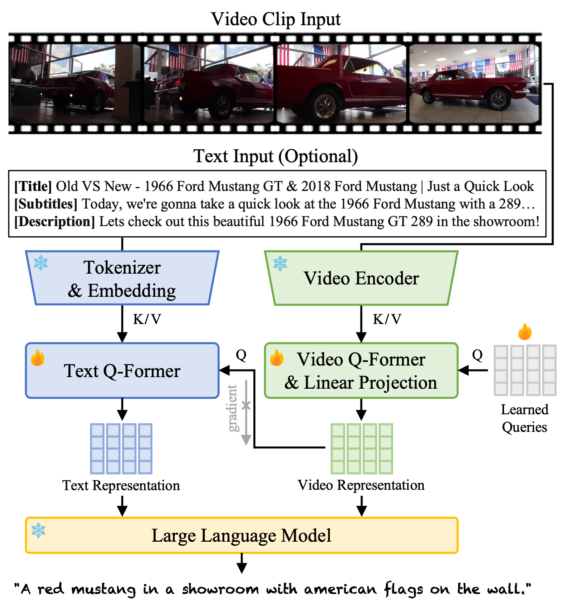

# 🐼 Panda-70M: Video Captioning

## Introduction
We propose a video captioning model to generate a caption for a short video clip.
The model includes vision (green) and textual (blue) branches to benefit video captioning by both video and text inputs.
We release the checkpoint trained on Panda-70M.
<p align="center" width="100%">
<a target="_blank"></a>
</p>

## Preparations
### Setup Repository and Enviroment
```
git clone https://github.com/tsaishien-chen/Panda-70M.git
cd Panda-70M/captioning

# create a conda environment
conda create --name panda70m_captioning python=3.9 -y
conda activate panda70m_captioning
pip install -r requirements.txt

# install default JRE
apt update
apt install default-jre
```
### Download Checkpoint
You can manually download the file [here](https://drive.google.com/file/d/1Gjp5LrgGJobcFi3AaXvLnzlY7IWXyaI5/view?usp=sharing) (3.82GB) and move it to the `checkpoint` folder or run:
```
wget --load-cookies /tmp/cookies.txt "https://docs.google.com/uc?export=download&confirm=$(wget --quiet --save-cookies /tmp/cookies.txt --keep-session-cookies --no-check-certificate 'https://docs.google.com/uc?export=download&id=1Gjp5LrgGJobcFi3AaXvLnzlY7IWXyaI5' -O- | sed -rn 's/.*confirm=([0-9A-Za-z_]+).*/\1\n/p')&id=1Gjp5LrgGJobcFi3AaXvLnzlY7IWXyaI5" -O checkpoint/checkpoint_best.pth && rm -rf /tmp/cookies.txt
```
### Prepare Vicuna:
- Please follow the [intructions](https://github.com/lm-sys/FastChat/blob/main/docs/vicuna_weights_version.md) from FastChat to install **vicuna-7b-v0** weight.
- **[Note]** You need to apply delta weights and after processed, the weights should be moved to `vicuna_weights/vicuna-7b-v0` folder with the file list like [this](https://github.com/snap-research/Panda-70M/blob/main/captioning/vicuna_weights/vicuna-7b-v0/README.md).

## Quick Demo
```
python inference.py --video-list inputs/video_list.txt --prompt-list inputs/prompt_list.txt
```
The code will caption two test videos listed in the `video_list.txt` with the extra inputs of textual information from the `prompt_list.txt`. Here are some output examples:
<table class="center">
    <tr style="line-height: 0">
        <td width=30% style="border: none; text-align: center"><b>Input Video</b></td>
        <td width=50% style="border: none; text-align: center"><b>Input Text</b></td>
        <td width=20% style="border: none; text-align: center"><b>Output Caption</b></td>
    </tr>
    <tr>
        <td width=30% style="border: none"></td>
        <td width=50% style="border: none; text-align: center"><sup>
          Some information about a video you will get:<br>
Transcription: Today we're gonna take a quick look at the 1966 Ford Mustang GT 289 v8 under the hood.<br>
Metadata: ['Old VS New - 1966 Ford Mustang GT & 2018 Ford Mustang | Just a Quick Look', 'Lets check out this beautiful 1966 Ford Mustang GT 289 in the showroom with the 2018 Ford Mustang!']<br>
Please look at the video and faithfully summarize it in one sentence.</sup></td>
        <td width=20% style="border: none; text-align: center">A red mustang parked in a showroom with american flags hanging from the ceiling.</td>
    </tr>
    <tr>
        <td width=30% style="border: none"></td>
        <td width=50% style="border: none; text-align: center">Please faithfully summarize the following video in one sentence.</td>
        <td width=20% style="border: none; text-align: center">An aerial view of a city with a river running through it.</td>
    </tr>
</table>

<sup>**We will remove the video samples from our dataset / Github / project webpage as long as you need it. Please contact tsaishienchen at gmail dot com for the request.</sup>

- **[Note]** You might get different outputs due to the randomness of LLM's generation.

## Evaluation
### Zero-shot Captioning Performance
  |            | BLEU-4 | ROUGE-L | METEOR | CIDEr | BertScore |
  |------------|--------|---------|--------|-------|-----------|
  | **MSRVTT** | 25.4%  | 50.1%   | 27.7%  | 31.5% | 87.9%     |
  | **MSVD**   | 32.8%  | 61.2%   | 35.3%  | 49.2% | 90.2%     |

- **[Note]** The results might not be perfectly reproduced due to the randomness of LLM's generation and could have an deviation of ±0.5%.

### Prepare Testing Data
- You can download the video samples here [[MSRVTT](https://www.robots.ox.ac.uk/~maxbain/frozen-in-time/data/MSRVTT.zip) / [MSVD](https://www.cs.utexas.edu/users/ml/clamp/videoDescription/)] and move them to `test_datasets/video_samples/MSRVTT` or `MSVD` folder.
- The caption annotations of the testing samples are already saved in `test_datasets/anno_downstream` folder.

### Evaluation
```
# MSRVTT
python inference.py --video-list test_datasets/video_list/msrvtt_test.txt --output-json msrvtt_caption.json
python compute_results.py --predict-json msrvtt_caption.json --target-json test_datasets/anno_downstream/msrvtt_caption_test.json

# MSVD
python inference.py --video-list test_datasets/video_list/msvd_test.txt --output-json msvd_caption.json
python compute_results.py --predict-json msvd_caption.json --target-json test_datasets/anno_downstream/msvd_caption_test.json
```

## Acknowledgements
The code for video captioning is built upon [Video-LLaMA](https://github.com/DAMO-NLP-SG/Video-LLaMA).
Thanks for sharing the great work!
